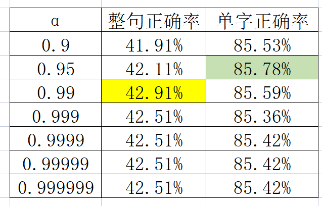
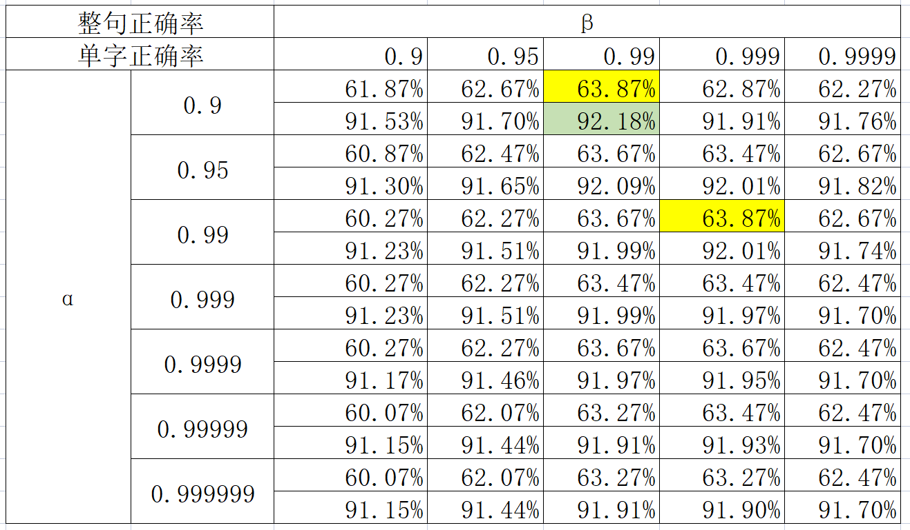

# AI导论第一次作业——拼音输入法 实验报告
<center>计03 吴垒 2020010916</center>
## 1 项目实现情况介绍
### 1.1 项目功能介绍
完成基本功能基于字的二元模型，附加功能基于字的三元模型，能实现对输入的拼音序列进行转换，输出对应的汉字序列。
### 1.2 项目仓库地址
[wulei20/IAI2023/pinyin_input_method](https://github.com/wulei20/IAI2023/tree/master/pinyin_input_method)
## 2 算法思路
### 2.1 字的二元模型
#### 2.1.1 模型介绍
基于字的二元模型，即对于输入的拼音序列，每次预测下一个字的概率时，只考虑前一个字。
#### 2.1.2 模型推导
设输入的拼音序列为$P_1P_2\cdots P_n$，输出的汉字序列为$C_1C_2\cdots C_n$，则模型的目标是求解$P_1P_2\cdots P_n$对应的$C_1C_2\cdots C_n$的概率最大的序列。
待求汉字序列即：$$C = \arg\max_{C_1C_2\cdots C_n}P(C_1C_2\cdots C_n|P_1P_2\cdots P_n)$$
由贝叶斯公式：
$$P(X|Y)=\frac{P(Y|X)P(X)}{P(Y)}$$
则有：
$$P(C_1C_2\cdots C_n|P_1P_2\cdots P_n)=\frac{P(P_1P_2\cdots P_n|C_1C_2\cdots C_n)P(C_1C_2\cdots C_n)}{P(P_1P_2\cdots P_n)}$$
其中$P(P_1P_2\cdots P_n)$为常数，不影响最大概率的求解，因此可忽略；在经过pypinyin进行注音后，可大致认为对某串字，其读音是可确定的，即对于每一个读音为$P_i$的$C_i$，其组合成的字符串$C$可以满足$P(P_1P_2\cdots P_n|C_1C_2\cdots C_n)=1$，因此可忽略。
故仅需求解：$$C = \arg\max_{C_1C_2\cdots C_n}P(C_1C_2\cdots C_n) = \arg\max_{C_1C_2\cdots C_n}\prod_{i=1}^nP(C_i|C_1\cdots C_{i-1})
\tag {1}$$
在字的二元模型中，估算每个字的概率可近似为由其前一个字的概率和转移概率决定，即：$$P(C_i|C_1\cdots C_{i-1}) \approx P(C_i|C_{i-1})$$
则有：$$C \approx \arg\max_{C_1C_2\cdots C_n}\prod_{i=1}^nP(C_i|C_{i-1})$$
而通过频率估算概率的方式，$P(C_i|C_{i-1})$可由训练集中的数据估算得到，即：$$P(C_i|C_{i-1}) = \frac{P(C_{i-1}C_i)}{P(C_{i-1})} \approx \frac{count(C_{i-1}C_i)}{count(C_{i-1})}$$
其中，$count(C_{i-1}C_i)$为训练集中$C_{i-1}C_i$出现的次数，$count(C_{i-1})$为训练集中$C_{i-1}$出现的次数。
而与此同时，还需要考虑某一个字与之前的字无关的情况，设这种情况出现的概率为$\alpha$，则有：$$P(C_i|C_{i-1}) = (1 - \alpha) {P(C_i)} + \alpha\frac{P(C_{i-1}C_i)}{P(C_{i-1})}
\approx (1-\alpha) \frac{count(C_i)}{count(C)} + \alpha\frac{count(C_{i-1}C_i)}{count(C_{i-1})}$$
其中，$count(C)$为训练集中所有字出现的次数。
对于第一个字，其前一个字不存在，因此可令$P(C_1|C_0) = P(C_1)$，即：$$P(C_1) = \frac{count(C_1)}{count(C)}$$
#### 2.1.3 具体实现
对于给定的拼音序列，求解其对应的汉字序列，即求解：$$C = \arg\max_{C_1C_2\cdots C_n}\prod_{i=1}^nP(C_i|C_{i-1})$$
由于概率值很小，因此可取对数求和，即：$$C = \arg\max_{C_1C_2\cdots C_n}\sum_{i=1}^nlogP(C_i|C_{i-1})$$
此时可考虑采用Vertibi算法，核心思想：动态规划，从前往后逐个预测每个字，每个字的预测只与前一个字有关。
通过prob_list记录每个读音为$P_i$的字出现在第i个位置的概率的对数，即$prob\_list[i][C_i]=logP(C_i|C_{i-1})$，通过character_chain_list记录第i个位置的字的前一个字，在完成一轮计算后可由prob_list得到最大概率的结尾字，最后通过character_chain_list反向推导出汉字序列。
其中，$prob\_list[i][C_i]$的计算方式为：$$prob\_list[i][C_i] = max_{C_{i-1}}(prob\_list[i-1][C_{i-1}] + logP(C_i|C_{i-1}))$$
而$character\_chain\_list[i][C_i]$的计算方式为：$$character\_chain\_list[i][C_i] = arg\max_{C_{i-1}}(prob\_list[i-1][C_{i-1}] + logP(C_i|C_{i-1}))$$
### 2.2 字的三元模型
#### 2.2.1 模型介绍
对于输入的拼音序列，每次预测下一个字的概率时，考虑其前两个字的概率，即：$$P(C_i|C_1\cdots C_{i-1}) \approx P(C_i|C_{i-1}C_{i-2})\tag{2}$$
#### 2.2.2 模型推导
对于给定的拼音序列，由$(1)$与$(2)$，即求解：$$C = \arg\max_{C_1C_2\cdots C_n}\prod_{i=1}^nP(C_i|C_{i-1}C_{i-2}) = \arg\max_{C_1C_2\cdots C_n}\sum_{i=1}^nlogP(C_i|C_{i-1}C_{i-2})$$
而同样考虑到某个字与之前两个字无关或与之前一个字的情况，设这两种情况出现的概率分别为$\beta、\alpha$，则有：$$P(C_i|C_{i-1}C_{i-2}) = (1 - \alpha)(1 - \beta) {P(C_i)} + \alpha(1-\beta)\frac{P(C_{i-1}C_i)}{P(C_{i-1})} + \beta\frac{P(C_{i-2}C_{i-1}C_i)}{P(C_{i-2}C_{i-1})}$$
其中，$P(C_{i-2}C_{i-1}C_i)$为训练集中$C_{i-2}C_{i-1}C_i$出现的次数，$P(C_{i-2}C_{i-1})$为训练集中$C_{i-2}C_{i-1}$出现的次数。
对前两个字，可按照二元模型的方式进行处理。
#### 2.2.3 具体实现
同样考虑采用Vertibi算法，核心思想：动态规划，从前往后逐个预测每个字，每个字的预测只与前两个字有关。
通过prob_list记录每个读音为$P_i$的字出现在第i个位置的概率的对数，即$prob\_list[i-1][C_{i-1}][C_i]=logP(C_i|C_{i-1}C_{i-2})$，通过character_chain_list记录从第i及i+1个字推导出第i-1个字，在完成一轮计算后可由prob_list得到最大概率的结尾两个字，最后通过character_chain_list反向推导出汉字序列。
其中，$prob\_list[i-1][C_{i-1}][C_i]$的计算方式为：$$prob\_list[i-1][C_{i-1}][C_i] = max_{C_{i-2}}(prob\_list[i-2][C_{i-2}][C_{i-1}] + logP(C_i|C_{i-1}C_{i-2}))$$
而$character\_chain\_list[i-1][C_{i-1}][C_i]$的计算方式为：$$character\_chain\_list[i-1][C_{i-1}][C_i] = arg\max_{C_{i-2}}(prob\_list[i-2][C_{i-2}][C_{i-1}] + logP(C_i|C_{i-1}C_{i-2}))$$
## 3 代码模块
### 3.1 项目结构
```bash
├── README.md
├── img
├── data
│   ├── input.txt
│   ├── output.txt
│   └── std_output.txt
├── src
│   ├── main.py
│   ├── model.py
│   ├── data_preprocessor.py
│   ├── constant.py
│   ├── batch.py
│   └── requirements.txt
├── train_data
│   ├── character
│   │   ├── 拼音汉字表.txt
│   │   └── 一二级汉字表.txt
│   ├── pretrain
│   │   ├── sina_news_output    # 中间文件，占用空间较大，未上传
│   │   ├── c2s_table.json
│   │   ├── s2c_table.json
│   │   ├── triple_occurance.json
│   │   ├── tuple_occurance.json
│   │   └── unit_occurance.json
│   ├── sina_news_gbk           # 语料库文件，占用空间较大，未上传
│   └── SMP2020                 # 语料库文件，占用空间较大，未上传
├── result.txt
└── report.md
```
### 3.2 项目文件介绍
#### 3.2.1 data
存放测试数据，包括输入数据、输出数据、标准输出数据。
#### 3.2.2 src
存放源代码，包括模型代码、数据预处理代码、常量定义代码、批处理代码。
#### 3.2.2.1 main.py
主函数，用于测试模型。
#### 3.2.2.2 model.py
模型代码，包括二元（`BinaryModel`）与三元模型（`TrigramModel`）的定义，从`pretrain`文件夹下读取预训练数据，通过`calculate_most_likely_sentence`函数实现对输入拼音序列的预测。
#### 3.2.2.3 data_preprocessor.py
数据预处理代码，包括使用python的pypinyin库对语料库的预处理，为每个汉字表中的字注音，以处理多音字，并统计字与二元、三元词的频率，将结果以`json`格式存放在`pretrain`文件夹下。
#### 3.2.2.4 constant.py
常量定义代码，包括汉字表、拼音表、拼音与汉字的映射表、汉字与拼音的映射表、字与词的频率统计数据文件所在的路径。
#### 3.2.2.5 batch.py
批处理代码，用于对不同$\alpha、\beta$的测试结果进行统计。
#### 3.2.3 train_data
存放训练数据，包括训练数据、预训练数据、字典、字与词的频率统计数据。
#### 3.2.4 result.txt
通过运行`python src/batch.py > result.txt`生成的结果文件，存放了对不同$\alpha、\beta$的测试结果。
#### 3.2.5 report.md
实验报告，包括实验结果、实验分析、实验总结。
### 3.3 项目运行
#### 3.3.1 环境配置
##### 3.3.1.1 python环境
python版本：3.10.10
##### 3.3.1.2 依赖生成方式(基于已有代码)
```
cd src
python -m pipreqs.pipreqs ./
```
windows平台需要注意将所有文件通过gbk方式保存后才可使用该指令。
##### 3.3.1.3 依赖内容
```bash
pypinyin==0.48.0
tqdm==4.65.0
```
##### 3.3.1.4 依赖安装方式
```
cd src
pip install -r requirements.txt
```
#### 3.3.2程序运行
##### 3.3.2.1 生成预训练数据
```bash
python src/data_preprocessor.py
```
##### 3.3.2.2进行单次测试
```bash
python src/main.py [--model MODEL] [--alpha ALPHA] [--beta BETA] [--input INPUT] [--output OUTPUT] [--notcheck NOTCHECK] [--std_output STD_OUTPUT]
```
命令行参数：
```bash
-m, --model: 模型选择，输入2或3选择二元或三元模型
-a, --alpha: 二元组权重
-b, --beta: 三元组权重
-i, --input: 输入文件路径
-o, --output: 输出文件路径
-n, --notcheck: 是否对比输出文件与标准输出文件，默认进行对比，设置为true时不会对比
-s, --std_output: 用于对比的标准输出文件路径
```
##### 3.3.2.3 进行批量测试
```bash
python src/batch.py > result.txt
```
## 4 实验结果
### 4.1 准确率展示
#### 4.1.1 二元模型

可以看出，当$\alpha=0.95$时，二元模型的字准确率最高，约为85%；$\alpha=0.99$时，二元模型的句准确率最高，约为42%。
#### 4.1.2 三元模型

可以看出，三元模型无论是字准确率还是句准确率，都是在$\alpha=0.9、\beta=0.99$时最高，且三元模型准确率明显高于二元模型，尤其句准确率提升明显，超过63%，字准确率超过92%。
### 4.2 案例展示
由于测试数据较多，这里仅选取效果最好的模型，即三元模型，$\alpha=0.9、\beta=0.99$，进行案例展示。
#### 4.2.1 正确案例
- ji qi xue xi shi dang xia fei chang huo re de ji shu
  - 机器学习是当下非常火热的技术
- ben ci pu cha huo dong you zhu yu bang zhu tong xue men zou chu xin li wu qu
  - 本次普查活动有助于帮助同学们走出心理误区
- zheng he xia xi yang wei qing hua ci de xun su jue qi ti gong le li shi qi ji
  - 郑和下西洋为青花瓷的迅速崛起提供了历史契机
- yan qi kai xue de tong zhi xia da hou bu jiu
  - 延期开学的通知下达后不久
- ni men que ding zhe xie qi guai de ju zi neng zheng que shu chu
  - 你们确定这些奇怪的句子能正确输出
#### 4.2.2 错误案例
- sun yang wei shen me yao da sui xue yang
  - 孙杨为什么要打碎**雪阳**（血样）
- cong ge zhong bu tong de shi jiao xue dao le hen duo xin de dong xi
  - 从各种不同的**是教**（视角）学到了很多新的东西
- da yan she de gong ji li lai dao le yi wan san qian dian
  - 大**盐摄**（岩蛇）的攻击力来到了一万三千点
- ni hou na me da sheng gan ma
  - **鲵后**（你吼）那么大声干**妈**（嘛）
- yuan shen shi yi kuan kai fang shi jie shou you
  - 原**身**（神）是一款开放**式接受有**（世界手游）
#### 4.2.3 案例分析
从正确案例中可以看出，三元模型对于一些较长的、或前后连贯性较强句子有了较好的分析能力。
然而，在错误案例中，也有不少拼音给出的句子是完全无法进行阅读的。
对于原因有如下猜测：
一方面是语料库的侧重问题。由于目前使用的新浪语料库内容均为新闻中获得，其覆盖面也会更加倾向于新闻题材，诸如“大岩蛇”、“原神”一类的游戏词汇收录较少，“你吼”“嘛”这类口语化的表达也会较少。
另一方面是三元组的划分与参数调整问题。如在分析“打碎血样”时，二元组占据比重过高导致“碎雪”被识别成一个词汇，使后续分析错误；而分析“开放世界手游”的时候，三元组的比重又偏高，因此“开放式”被识别为完整词汇，导致最终识别错误；此处感觉需要加入分词操作、构造基于词的模型构建更长的语法模型才能解决这一平衡问题。
总体看来，问题主要出在语料库的偏向性与模型的局限性上，可在这两方面进行改进以进一步提升准确率。
## 4 总结
本次实验为人智导课程第一次作业，也让我对AI领域最基础的模型有了深刻的了解。
通过实验，我对隐Markov模型及Vertibi算法的原理及思想有了进一步的理解，认识到了大数据在当今社会的重要性，并对AI模型的建立及调参的困难程度有了一定的认识。
同时，在实验中我也学会了批处理操作，及可视化输出数据处理情况以确保程序正常运行，这点对以后的编程实验将会有很大的帮助。